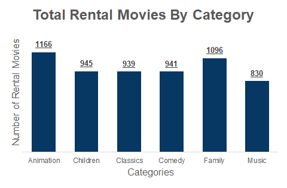

# Sakila DVD Rental Analysis

### Introduction
I`m Currently working on [Programming for Data Science Nanodegree](https://www.udacity.com/course/programming-for-data-science-nanodegree--nd104) at [Udacity](https://www.udacity.com) and this project is a part of my Nanodegree study.

### Dataset
**Sakila DVD Rental database** <br>
The Sakila Database holds information about a company that rents movie DVDs.<br>
For this project, we will be querying the database to gain an understanding of the customer base, such as what the patterns in movie watching are across different customer groups, how they compare on payment earnings, and how the stores compare in their performance. <br>
And here is the schema for the DVD Rental database is provided below.


* actor — contains actors data including first name and last name.
* film — contains films data such as title, release year, length, rating, etc.
* film_actor — contains the relationships between films and actors.
* category — contains film’s categories data.
* film_category — containing the relationships between films and categories.
* store — contains the store data including manager staff and address.
* inventory — stores inventory data.
* rental — stores rental data.
* payment — stores customer’s payments.
* staff — stores staff data.
* customer — stores customer’s data.
* address — stores address data for staff and customers
* city — stores the city names.
* country — stores the country names.

### Objective & Goals
**In this project, I’ll aim to answer the following questions:**
1) What were Total Rental for Family Movies ?
2) How many movies in each category devided by duration quartile?
3) What is the number of rentals per month for each store?
4) How much did our top customers pay in each month in 2007?


### Analysis
1) What were Total Rental for Family Movies ?
To answer this question first let`s look at the query used to answer this question.
```sql
WITH t1 AS (
		SELECT f.title as film_title,
			   c.name AS category_name,
			   r.rental_id
		FROM film f
		JOIN film_category as fc
		ON   f.film_id = fc.film_id
		JOIN category c
		ON   c.category_id = fc.category_id
		JOIN inventory i
		ON   f.film_id = i.film_id
		JOIN rental r
		ON 	 i.inventory_id = r.inventory_id	   
)

   SELECT film_title,
	        category_name,
	        COUNT(rental_id) AS rental_count
    FROM t1
   WHERE category_name 
      IN ('Animation', 'Children', 'Classics', 'Comedy', 'Family', 'Music')
GROUP BY 1, 2
ORDER BY 2, 1;

```



The plot here showing the total rental for family movies. <br>
And as we can see, the animation movies are the top rented movies followed by family.


2) How many movies in each category devided by duration quartile?
To answer this question first let`s look at the query used to answer this question.
```sql
WITH t1 AS (
		SELECT f.title as film_title,
	         c.name AS category_name,
			     NTILE(4) OVER (ORDER BY f.rental_duration) AS standard_quartile
		 FROM film f
		 JOIN film_category as fc
		USING (film_id)
		 JOIN category c
		USING (category_id)
)
  SELECT DISTINCT * 
   FROM (
   SELECT category_name,
	        standard_quartile,
	        COUNT(film_title) 
	        OVER(PARTITION BY standard_quartile ORDER BY category_name)
    FROM t1
   WHERE category_name 
      IN ('Animation', 'Children', 'Classics', 'Comedy', 'Family', 'Music')
ORDER BY 1) sub

```


The plot here showing the total family movies for each categories devided by each duration quartile.<br>
And as we can see that music category has the most number of movies with total 361 movies.


3) What is the number of rentals per month for each store?
To answer this question first let`s look at the query used to answer this question.
```sql
   SELECT s.store_id,
	        EXTRACT(ISOYEAR FROM r.rental_date) AS rental_year,
	        EXTRACT(MONTH FROM r.rental_date) AS rental_month,
	        COUNT(r.rental_id) AS count_rentals
     FROM rental r
     JOIN staff 
    USING (staff_id)
     JOIN store s
    USING (store_id)
 GROUP BY 1, 2, 3
 ORDER BY 1, 2, 3;

```


The plot here show a comparison between the 2 stores for each month.<br>
And as we can see there is no significant defference between the 2 stores.


4) How much did our top customers pay in each month in 2007?
To answer this question first let`s look at the query used to answer this question.
```sql
WITH top_paying_customers AS (
  SELECT C.customer_id,
	       SUM(p.amount) AS total_payment
    FROM customer c
	  JOIN payment p
   USING (customer_id)
GROUP BY 1
ORDER BY 2 DESC
LIMIT 10 	
)

	SELECT c.first_name || ' ' || c.last_name AS customer_name,
		     DATE_TRUNC('month', p.payment_date) AS payment_month,
		     COUNT(p.payment_id) AS num_payments,
		     SUM(p.amount) AS total_payment
	  FROM customer c
    JOIN payment p
	 USING (customer_id)
	  JOIN top_paying_customers
	 USING (customer_id)
  GROUP BY 1, 2
  ORDER BY 1, 2

```


The plot here show a comparison between our top 10 customers for each month in 2007.<br>
And As we can see they tend to rent more movies in Apr.


#### Find me in social media
[](https://github.com/ahmed-gharib89 "Github")
[](https://www.linkedin.com/in/ahmed-abdel-moniem-gharib/ "LinkedIn")
[](https://www.facebook.com/just.nimo/)
[](https://wa.me/201096995535?text=Hello)
[](https://www.instagram.com/ahmed.gharib89/)
